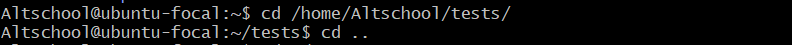

# Altschool Live Class Assignment 1

## Tasks

Your login name: altschool i.e., home directory /home/altschool. The home directory contains the following sub-directories: code, tests, personal, misc Unless otherwise specified, you are running commands from the home directory.

#### a. Change directory to the tests directory using absolute pathname

#### b. Change directory to the tests directory using relative pathname

#### c. Use echo command to create a file named fileA with text content ‘Hello A’ in the misc directory

#### d. Create an empty file named fileB in the misc directory. Populate the file with a dummy content afterwards

#### e. Copy contents of fileA into fileC

#### f. Move contents of fileB into fileD

#### g.Create a tar archive called misc.tar for the contents of misc directory

#### h.Compress the tar archive to create a misc.tar.gz file

#### i. Create a user and force the user to change his/her password upon login

created user with password

command to make user change password

new user attempt to login

#### j. Lock a users password

#### k. Create a user with no login shell

#### l. Disable password based authentication for ssh

#### m. Disable root login for ssh

